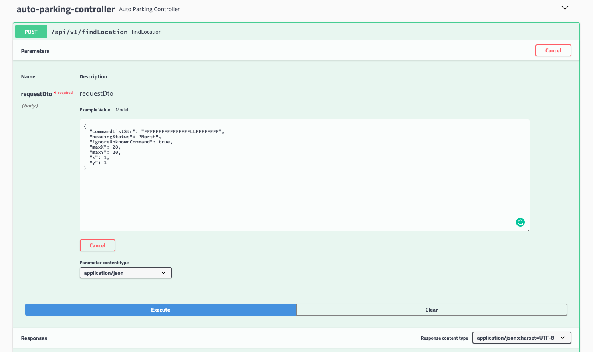

# Auto Parking System Doc

## How to use?

The project is based on the spring-boot and angular 8. There are several usages：

1. Use the angular frontend to test the function with visualization
2. Use the Swagger UI to play the API directly with more options
3. Check Unit test to review the code

### Run Local or Online

#### Local

Linux
```bash  
./mvnw spring-boot:run
# or you can use the Makefile: make to run
make
```
Windows
```bash  
./mvnw.cmd spring-boot:run  
```

Then access [http://localhost:8080/](http://localhost:8080/)

Unit Tests
```bash  
# Linux
./mvnw test
# windows
./mvnw.cmd test
```
#### Online

I have deployed the application to the Heroku (free Dyno):  
  
Webapp: https://auto-parking.herokuapp.com/  
  
The Swagger-UI: https://auto-parking.herokuapp.com/swagger-ui.html

### Angular Frontend

This is basic Angular 8 project to demo the auto car parking system. The frontend only support the (15, 15) max x and y.

User can choose initial X and Y and input the Command list.

After that there are two choices: 

1. Use the backend API to calculate the result. click button: **Start to Calculate**
2. Use the frontend to simulate the calculate process visually. click button: **Start to Simulation**

#### Calculate


After click the **Start to calculate** button, the result will be displayed right side.


#### Simulation


After click the  **Start to simulation** button, the car will be displayed in the initial location of the Grid map. All the related information will be display. You need to click the button **Next Command**, the frontend will simulate to run this command and update the car location and related information. 

After all commands are executed, the **Next Command** will be disable, and you can see the final result on the Map.

You can click the **Reset** button to reset and restart the Simulation process.


If next command to make the location out of the map (min or max), there will be warning message pop up and this command will be ignored.


### Swagger UI try API
 

 
The backend API [http://localhost:8080/swagger-ui.html#/auto-parking-controller/findLocationUsingPOST](http://localhost:8080/swagger-ui.html#/auto-parking-controller/findLocationUsingPOST) has more options:

Request

```json
{
  "commandListStr": "FFFFFFFFFFFFFFFFLLFFFFFFFF",
  "headingStatus": "North",
  "ignoreUnknownCommand": true,
  "maxX": 20,
  "maxY": 20,
  "x": 1,
  "y": 1
}
```

1. commandListStr  [Required]:  the string of command list
2. headingStatus  [Optional, default is North]: initial car heading
3. ignoreUnknownCommand  [Optional, default is true]: ture means if there is unknown command char in commandListStr it will be ignored. false means only accept the llegal command or return error directly.
4. maxX [Optional, default is 15]: the max of x coordinates
5. maxY [Optional, default is 15]: the max of y coordinates
6. x[Required]: the initial location x coordinates
7. y[Required]: the initial location y coordinates

## Introduction

### Algorithm


### How to handle location out of parking space?

Current implementation: If one command make the location illegal (out of the parking area), the command will be ignored and an error message will be set to the location information.

location check condition:

```
x>=1 && x <= MaxY
y>=1 && y <= MaxY
```

## build and run detail

The application is based on the Spring Boot and Angular. Meanwhile, I have use the `frontend-maven-plugin` build and copy frontend resource to the target, so run the application in local is very easy with the following command.

The default development port is **8080**, please make sure the port is not listened by other application. After run the command, visit the browser : http://localhost:8080

### Linux/Mac OS

```bash
./mvnw spring-boot:run
```

### Windows

```bash
./mvnw.cmd spring-boot:run
```

### Separate Backend and Frontend

If you would like to run the backend and frontend separately, just need to run the frontend with default port `9000`.

```bash
cd src/main/webapp/
npm start
```

The Angular development configuration use the default backend url and port: http://localhost:8080
 
### Spring Boot Rest API and Swagger

The backend is based on the Spring Boot with Rest API and Swagger support with the SpringFox

### Angular Frontend Framework

The frontend is based on the Angular with Material Design and several 3rd packages such as `ngx-logger` and `ISO-639-1` and so on.
